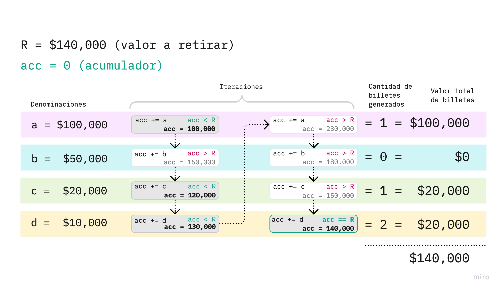
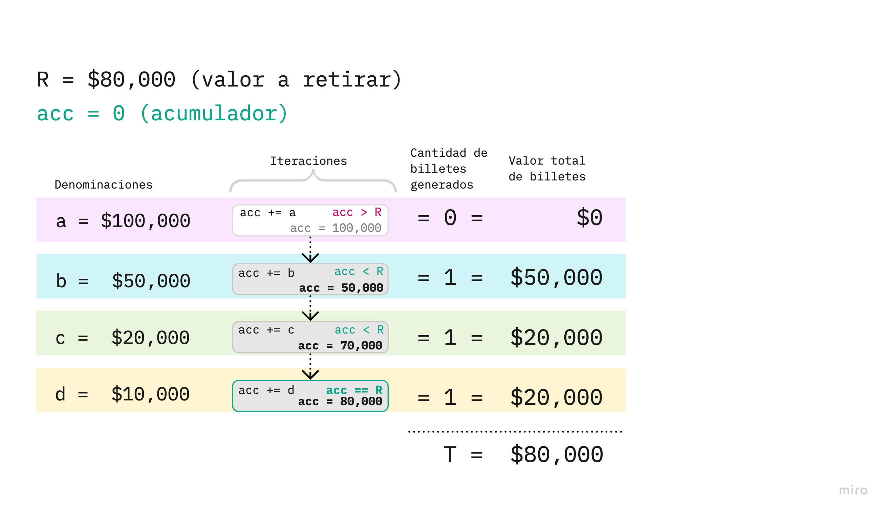

# Programación básica

## Evaluación distancia 1
**Simulación de un cajero automático**
Denominaciones:
- 100 billetes de $10,000 ($1,000,000),
- 50 billetes de $20,000 ($1,000,000),
- 20 billetes de $50,000 ($1,000,000),
- 10 billetes de $100,000 ($1,000,000).

**Regla:**
- [x] Retiro mínimo: $10.000.
- [x] Saldo: aleatorio entre $100.000 y $300.000.
- [x] El cajero puede entregar dinero de diferente denominación.

Ejemplo 1: algoritmo con retiro de $140,000:

Ejemplo 2: algoritmo con retiro de $80,000:

