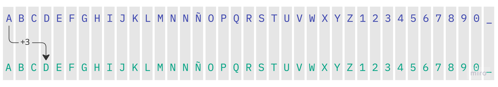

# Programación básica

## Eval. Distancia 2

### Actividad 1:
Ejecutar el archivo `rot13.py` con Python 3:
```
$ python3 rot13.py
```
---

### Resumen del ejercicio:
Algoritmo de cifrado Cesar y/o ROT13.



Ejemplo:
```
1. Original:    HOLA
2. Encriptada:  KRND
```
https://es.wikipedia.org/wiki/Cifrado_C%C3%A9sar (desplazamiento 3 posiciones)
https://es.wikipedia.org/wiki/ROT13 (Desplazamiento 13 posiciones)
