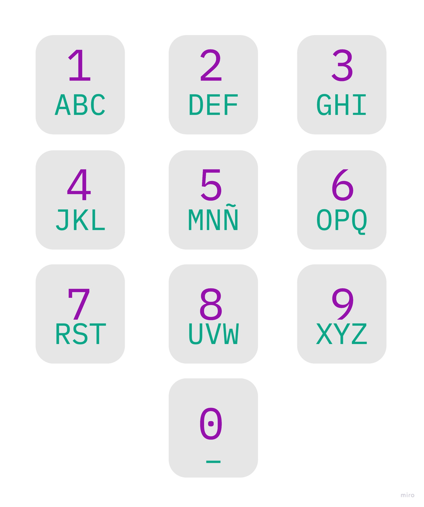

# Programación básica

## Eval. Distancia 2

### Actividad 2:
Ejecutar el archivo `teclado.py` con Python 3:
```
$ python3 teclado.py
```
---

### Resumen del ejercicio:
- Convertir a números el texto digitado, de acuerdo a un teclado numérico tradicional.

Ejemplo teclado:


Ejemplo de texto: _"Hola"_
```
H: Tecla 3 - 2 veces
O: Tecla 6 - 1 veces
L: Tecla 4 - 3 veces
A: Tecla 1 - 1 veces

Resultado final: 3364441
```